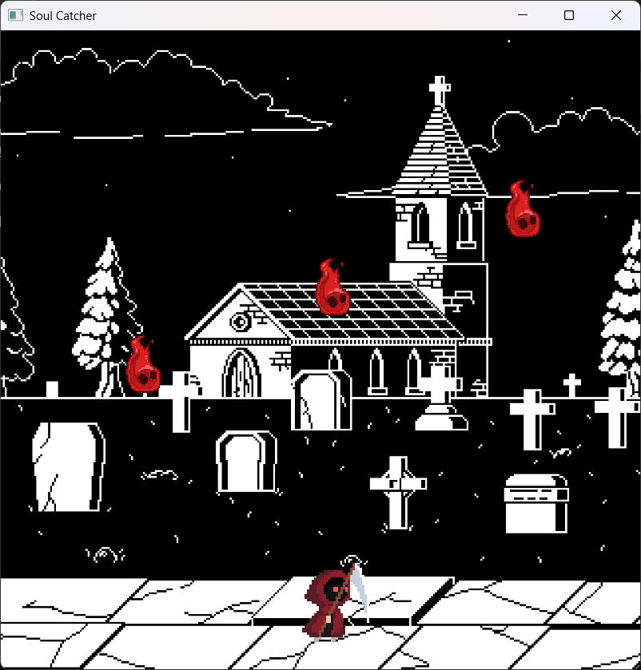

# 🕹️ Soul Catcher



## 🎮 Sobre o Projeto

**Soul Catcher** é um protótipo de jogo 2D em estilo arcade desenvolvido como parte do **Trabalho do Grau A** para a disciplina de **Processamento Gráfico: Fundamentos**.

O objetivo do jogo é controlar um personagem na parte inferior da tela, movendo-o para a esquerda e para a direita para coletar as "almas" que caem do topo.  
O jogador perde se deixar **5 almas** passarem. A dificuldade aumenta progressivamente com o tempo, tornando a queda das almas mais rápida.

---

## 🚀 Funcionalidades

### 🎯 Gameplay
- **Controle de Personagem:** Movimentação fluida para a esquerda e direita com as teclas de seta.  
- **Coleta de Itens:** Almas são coletadas ao colidir com o personagem.    
- **Condição de Derrota:** O jogo termina se o jogador deixar 5 almas passarem.  
- **Dificuldade Progressiva:** A velocidade de queda das almas aumenta continuamente com o tempo de jogo.  
- **Variação de Inimigos:** Cada alma possui uma velocidade de queda individual e aleatória, tornando o jogo mais imprevisível.  
- **Feedback Visual:** O personagem executa uma animação de ataque ao coletar uma alma.  

---

## 🧠 Técnicas Utilizadas

- **Renderização 2D:** Utiliza a API gráfica OpenGL 3.3+ (Core Profile) para renderização.  
- **Estrutura Orientada a Objetos:** Código modularizado em classes (Game, Player, Soul, Shader).  
- **Animação por Spritesheet:** Animações implementadas via spritesheets, com controle de frames no *Vertex Shader*.  
- **Detecção de Colisão:** Algoritmo AABB (Axis-Aligned Bounding Box).  
- **Gerenciamento de Dependências:** Bibliotecas externas (GLFW, GLM, stb_image) configuradas via CMake com *FetchContent*.  

---

## 🛠️ Como Compilar e Executar

### 📋 Pré-requisitos
- **CMake** (versão 3.11 ou superior)  
- **Compilador C++** com suporte a **C++17** (GCC/MinGW, Clang ou MSVC)  
- **Git** (para o *FetchContent*)  

### ⚙️ Passos

```bash
# Clone o repositório
git clone https://github.com/arthur-palma/2D-Game-PG.git
cd 2D-Game-PG

# Crie e acesse o diretório de build
mkdir build
cd build

# Configure o projeto com CMake
cmake -G "MinGW Makefiles" ..

# Compile o projeto
cmake --build .

#Volte a pasta principal
cd ..

# Execute o jogo
.\build\SoulCatcher.exe
```

---

## ⌨️ Controles

| Tecla | Ação |
|:------|:------|
| ← / → | Mover o personagem |
| ESC | Fechar o jogo |

---

## 📂 Estrutura do Código

| Classe | Responsabilidade |
|:--------|:------------------|
| **Game** | Gerencia a janela, loop principal e estado do jogo. |
| **Player** | Lida com input, movimento, colisão e animações. |
| **Soul** | Representa um inimigo; controla posição e velocidade de queda. |
| **Shader** | Abstrai o carregamento e compilação de shaders GLSL. |

---

## 📚 Dependências

- **GLFW:** Criação de janela e gerenciamento de input.  
- **GLAD:** Carregamento de funções modernas do OpenGL.  
- **GLM:** Operações matemáticas com vetores e matrizes.  
- **stb_image:** Carregamento de texturas.  

> Todas as dependências (exceto GLAD) são baixadas e configuradas automaticamente via **CMake**.

---

## 🧑‍💻 Autores

Arthur Palma, Marcelo Calsing e Otto Schimtz
Desenvolvido para a disciplina de **Processamento Gráfico: Fundamentos**  
📍 **UNISINOS**
